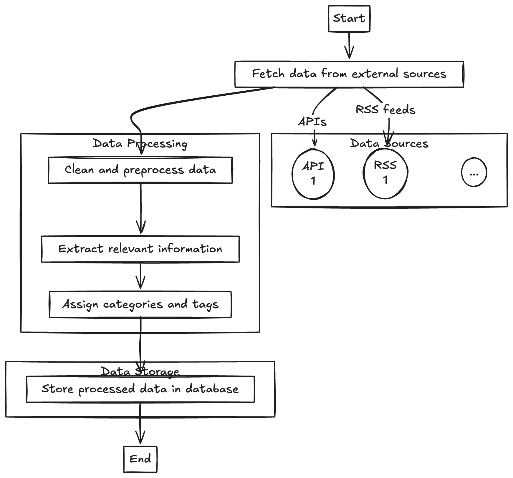
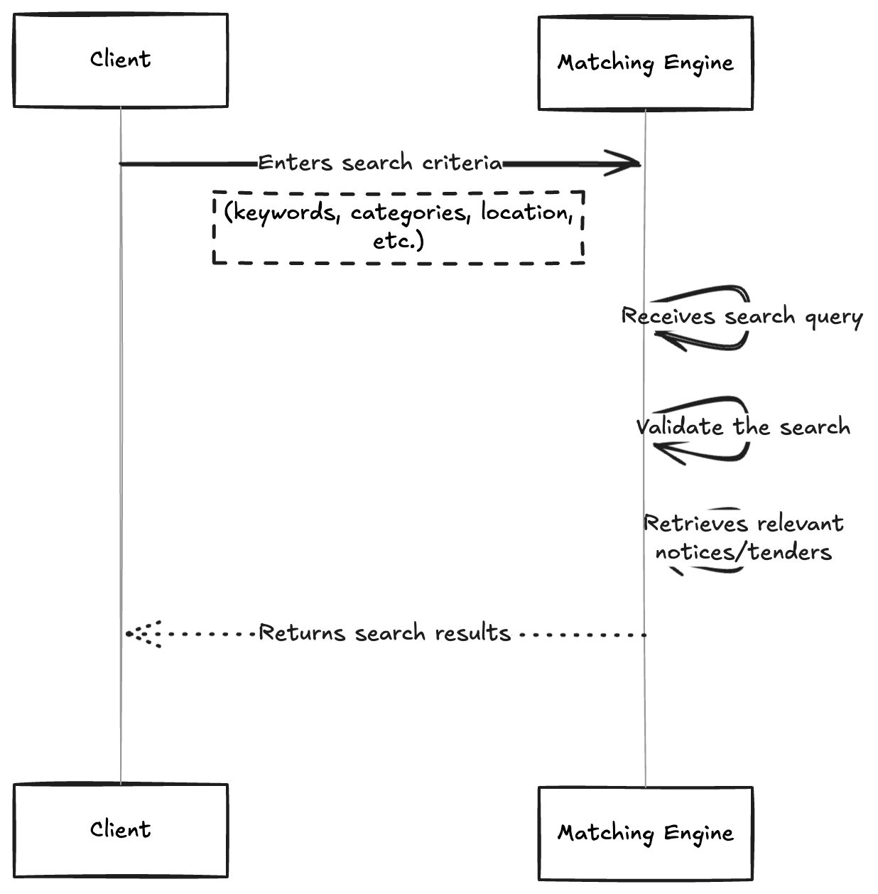
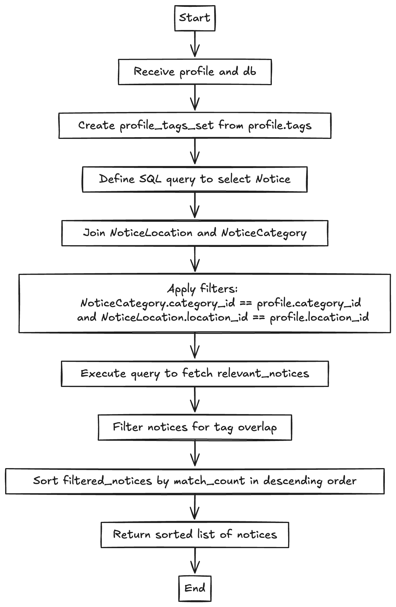

# Welcome to TendAlex, the Next Generation of Tender Matching!

## Overview

This document details our exciting solution for the tender notice matching application, developed as
part of the Tender AI Challenge. Our goal is to streamline the process of matching procurement
notices with user profiles based on key criteria, including categories, locations, and tags.

## Architecture

We've designed the application with a modular approach, utilizing a range of strategies for data
extraction, transformation, and processing. Let’s break down the main components:

1. **Data Extraction**:
    - We implement a **Strategy Pattern** to define various methods for loading data, whether it’s
      from JSON files or APIs.
    - Our `DataExtractService` applies these strategies to ensure the data is ready for processing.

2. **Data Transformation**:
    - Raw data gets transformed into structured models through our `DataTransformService`, which
      also employs the Strategy Pattern for different data formats.
    - We use the `NoticeModel` to represent tender notices, complete with all the relevant fields.

3. **Analysis and Matching**:
    - The `Analyzer` class, particularly its implementation `OpenAIAnalyzer`, taps into the OpenAI
      API to identify related category and location IDs based on the content of the notices.
    - The `DataProcessorService` manages the flow of notice processing, linking them to the correct
      categories and locations before storing them in the database.

4. **FastAPI Backend**:
    - Our application exposes a user-friendly RESTful API via FastAPI, making it easy for users to
      create profiles, fetch matching notices, and manage their data.

5. **Database**:
    - We use SQLite for persistent storage, handling entities like `Notice`, `Category`, `Location`,
      and `Profile` through SQLModel, which simplifies our interactions with the database.

## Implementation Details

### Data Models

- **NoticeModel**: This model encapsulates a tender notice's essential attributes, including title,
  description, location, buyer, volume, and deadlines.
- **Profile**: This model captures user-specific details like category ID, location ID, and tags for
  effective matching.
- **Relationships**: Our system supports many-to-many relationships between notices and
  categories/locations using `NoticeCategory` and `NoticeLocation`.

### Data Extraction Strategies

1. **JSONDataExtractStrategy**: Loads data from JSON files seamlessly.
2. **APIDataExtractStrategy**: This is a placeholder for future implementations, where we’ll connect
   to external APIs for dynamic data extraction.

### Data Transformation

To ensure that our raw data is effectively converted into structured models (like `NoticeModel`), we
have a dedicated transformation strategy that emphasizes type safety and usability.

### Analysis with OpenAI

The `OpenAIAnalyzer` works closely with the OpenAI API to predict the best matching categories and
locations for each notice based on its content. The structured predictions help us link notices to
the right categories and locations in our database.

### FastAPI Routes

- **GET /profiles/{profile_id}/matches**: Fetches matching notices tailored for a specific profile.
- **POST /profiles**: Creates a new user profile effortlessly.
- **GET /profiles/{id}**: Retrieves a profile based on its ID.
- **DELETE /profiles/{id}**: Deletes a profile by its ID when it’s no longer needed.

## Key Components of Our System

1. **Data Ingestion Layer**:
    - This layer gathers data from various sources, including APIs and user inputs, to keep our
      application rich with information.

2. **Data Processing Layer**:
    - We leverage OpenAI for summarizing and tagging the data we ingest, which greatly aids in our
      analysis and categorization efforts.

3. **Data Storage Layer**:
    - This layer ensures data persistence, managing everything from processed data to user profiles,
      notices, and feedback in a reliable manner.

4. **Matching Engine (Search Service)**:
    - Our search functionalities are designed to connect users with relevant content based on their
      profiles and preferences. This engine is scalable and separate from the main application to
      enhance performance.

5. **Backend Service Layer**:
    - This layer encapsulates our core business logic and handles requests from the front end,
      facilitating smooth communication across system components.

### Design Diagram

Here’s a high-level design overview of our application:

## Challenges and Future Work

As we look to the future, we’ve identified several areas for improvement:

- **Data Validation**: While we have basic validation in place, we could enhance our mechanisms to
  ensure data integrity even further.
- **API Data Extraction**: The `APIDataExtractStrategy` is currently a placeholder; we plan to
  implement this to allow for dynamic data loading from external sources.
- **Scalability**: We’re considering moving to a more robust database solution, like PostgreSQL, and
  potentially integrating Elasticsearch for improved search capabilities.
- **Advanced Search Features**: Adding full-text search, filtering, and sorting options will
  significantly enhance the user experience.
- **Database Evaluations**: As our application grows, we’ll evaluate other database solutions to
  optimize performance and scalability.
- **User Feedback Mechanism**: We want to establish a feedback system to refine our matching
  algorithm based on user interactions over time.
- **Notification System**: We aim to introduce notifications to alert users about new matching
  notices that align with their profiles.